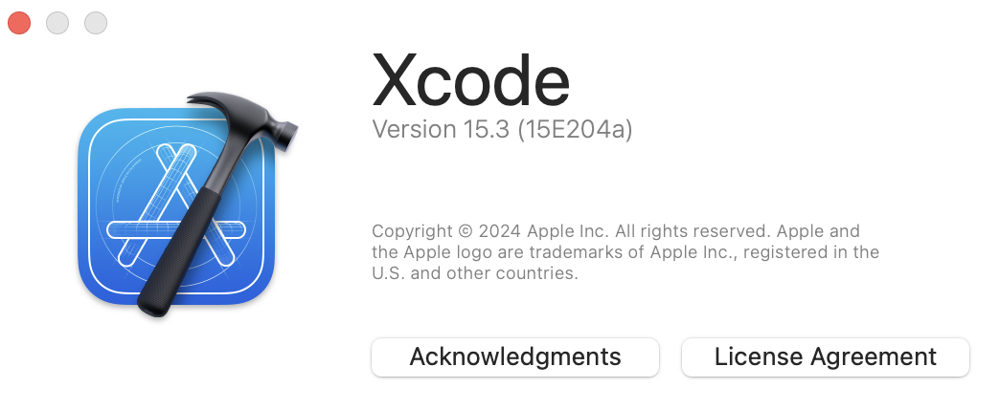
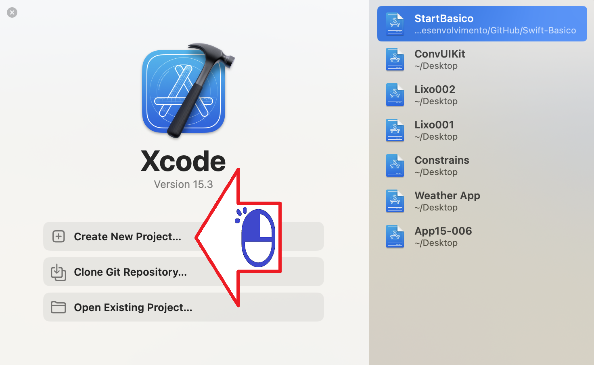
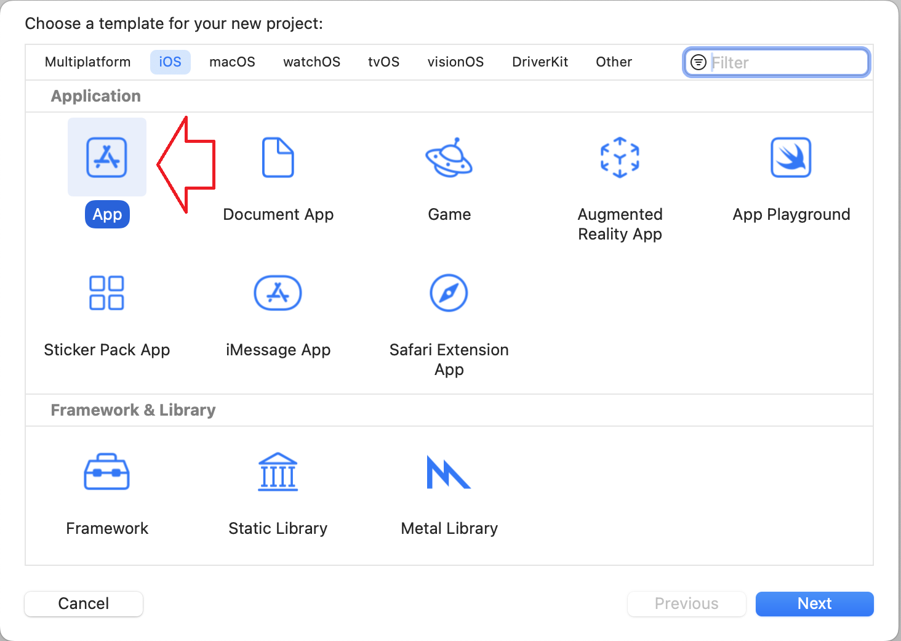
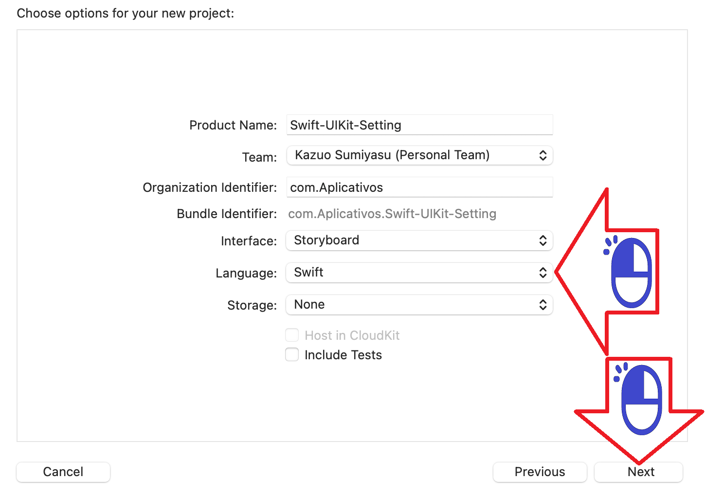
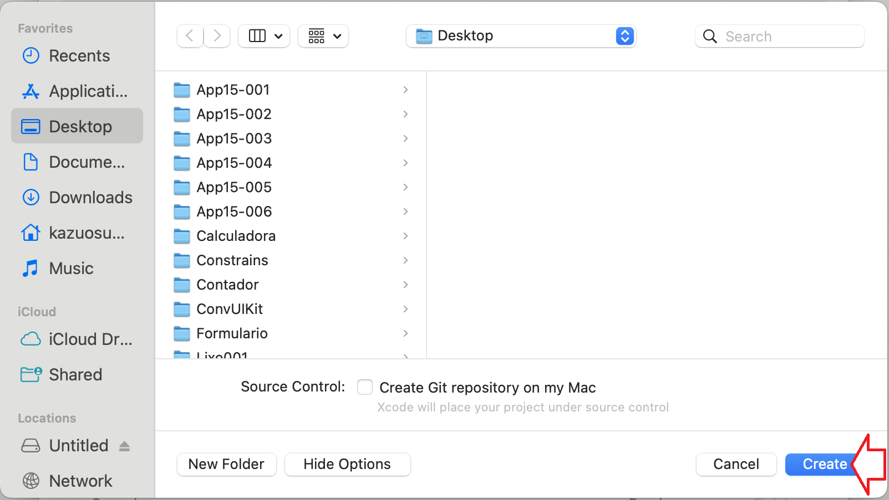
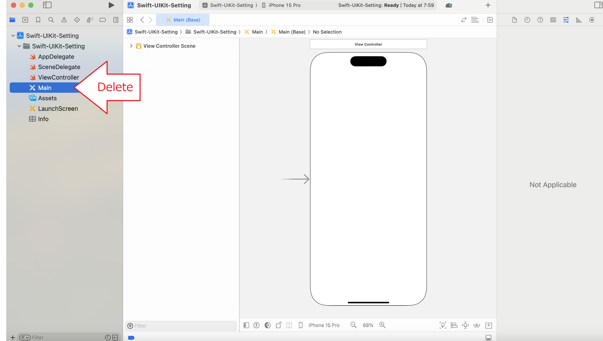
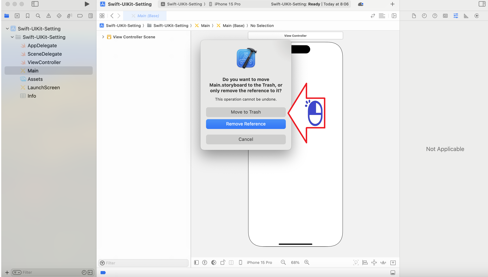
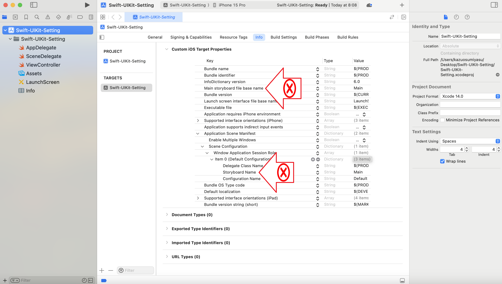
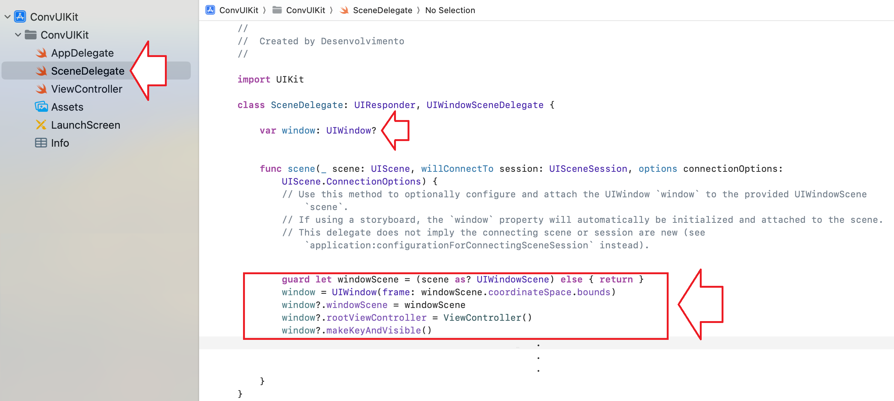

# Configuração Swift

Configurando o Xcode para usar o UIKit

Figura 01 - Versão do Xcode

Figura 02 - Abra um novo projeto

Figura 03 - Escolha App para seu projeto

Figura 04 - Escolha Swift como linguagem

Figura 05 - Crie seu projeto

Figura 06 - Delete o Main que contem o Storyboard

Figura 07 - Confirme a exclusão

Figura 08 - Delete as referencias do Storyboard

Figura 09 - Definindo nossa ViewController no SceneDelegate

