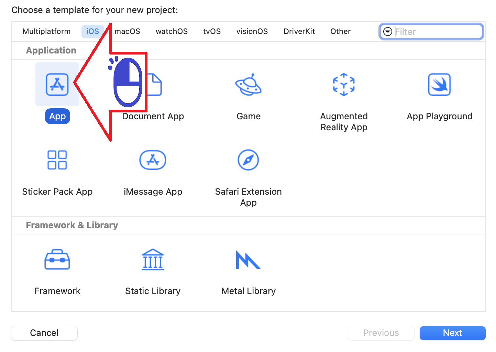

# Configuracao Swift

Configurando o Xcode para usar o UIKit
UIKit を使用するように Xcode を構成する

##### Figura 01

##### Figura 02

##### Figura 03

##### Figura 04

##### Figura 05

##### Figura 06

##### Figura 07

##### Figura 08

