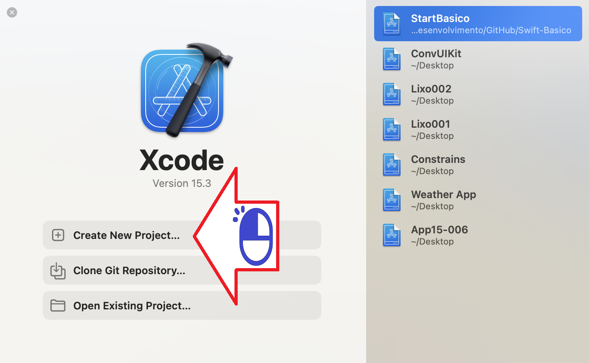
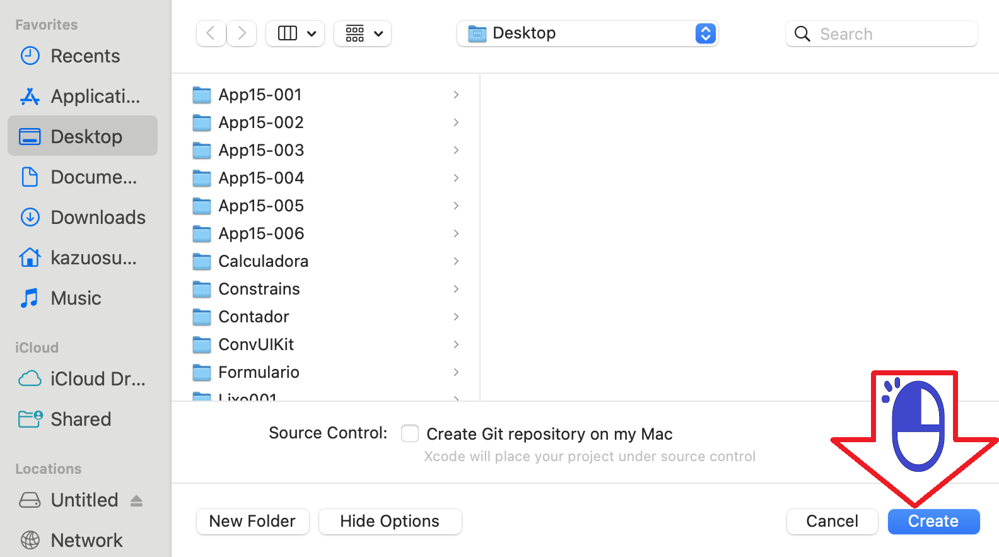

# Swift の 設定

UIKit を使用するように Xcode を準備する

絵 01 - Xcodeのバージョン

絵 02 - 新しいプロジェクトを開く

絵 03 - Appを選択してください

絵 04 - 言語として Swift を選択してください

絵 05 - プロジェクトを作成する

絵 06 - Storyboardを含むMainを削除する

絵 07 - 削除を確認する

絵 08 - Storyboardから参照を削除する

絵 09 - SceneDelegateでViewControllerを準備する

